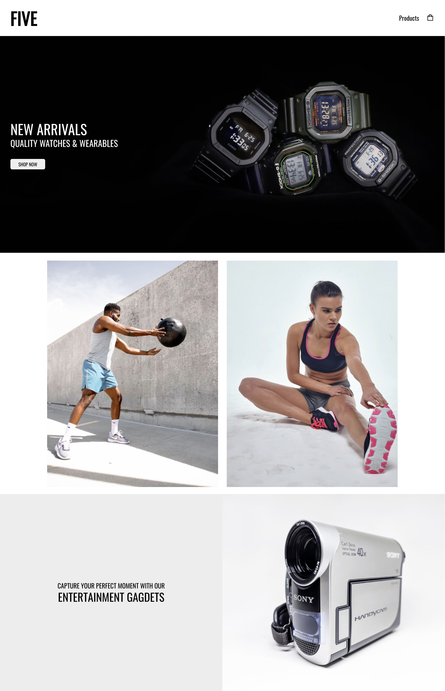
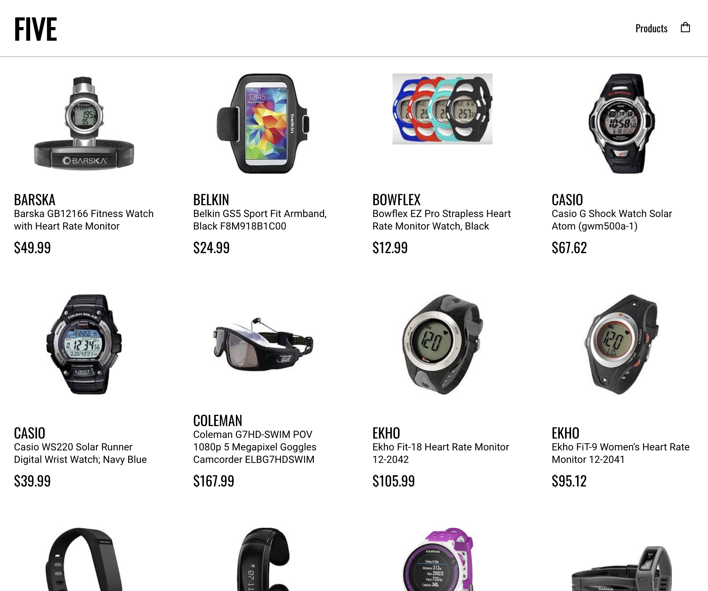
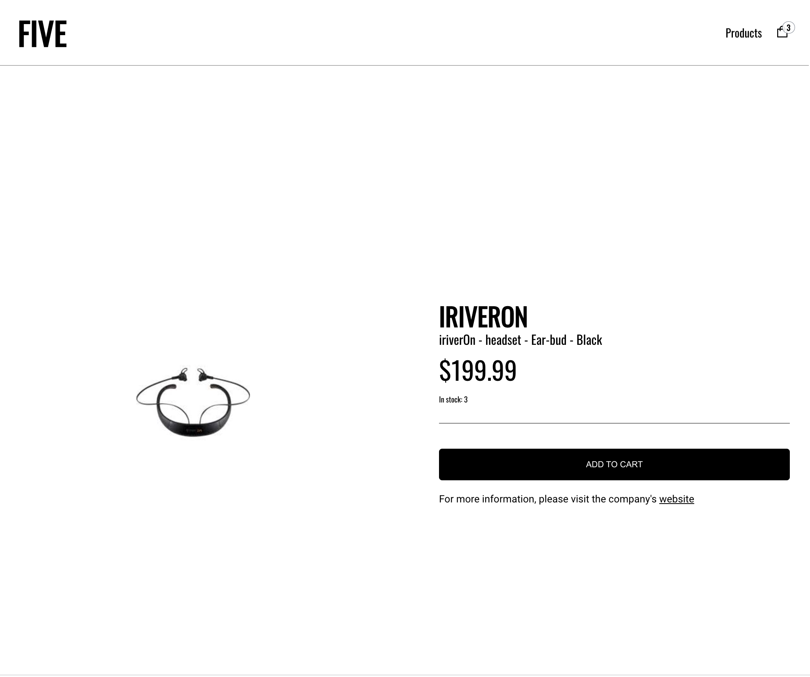
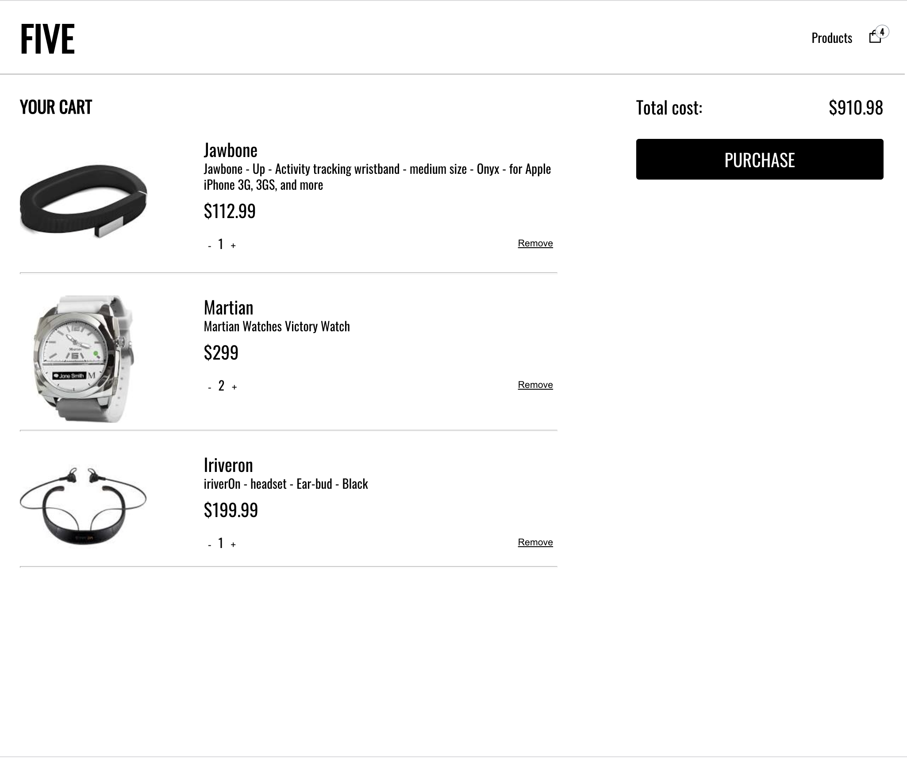

# Five

# Introduction

Five is an ecommerce group project. The store Five displays a variety of products that can be added to the cart and purchased. This project was in collaboration with Flyod Cheng, Oliver, and Eugene.

The website was designed by me and you can view the figma link [here](https://www.figma.com/file/HmPOblpCFOkRp7FYhJLSUF/Five?node-id=36%3A115)

To get started, in the terminal. Enter cd server, and then hit yarn start. Then cd client, and hit yarn start as well.

# Project

## Coding Languxages

Five uses React.js for the front-end. For the back-end, Node.js.

## Home

The home page shows a variety of prorducts.

## Products

On the product page, it lists out all the products from the server in alphabetical order.

## Product Details

The product detail page includes the link to the website of the brand, as well as the price of the product and the number of stock left. If there isn't anymore in stock, the button will be disabled. When the product is added, the number on the cart icon increases as well.

## Cart

On the cart page, we can increase the quantity of the each product or complete remove it from the basket. It also indicates the total cost for the items in the cart.

